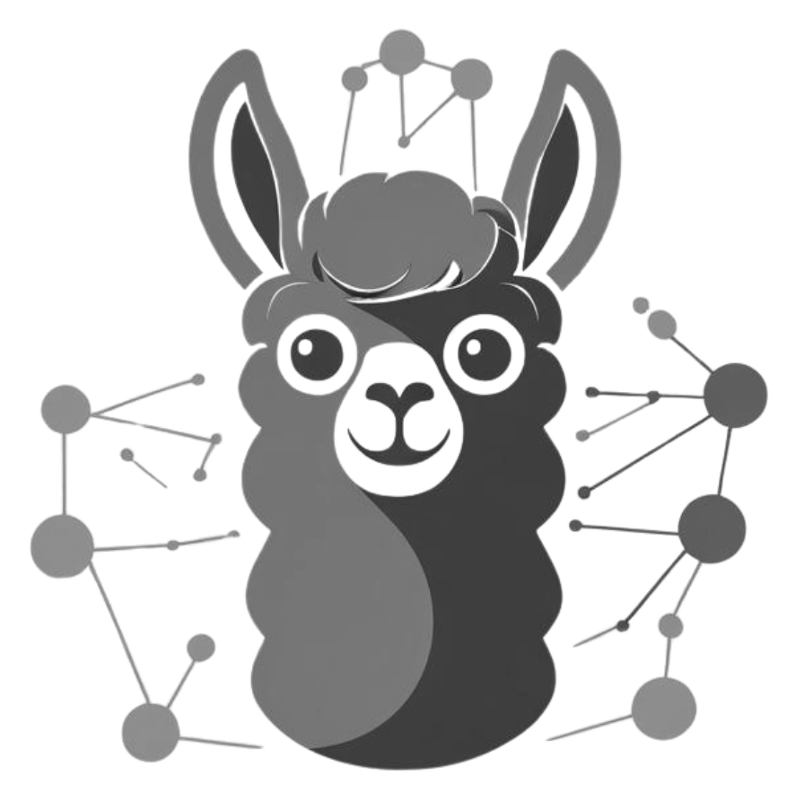

# CrowdLlama

[](https://github.com/crowdllama/crowdllama/actions/workflows/ci.yml)



CrowdLlama is a distributed system that leverages the open-source [Ollama project](https://github.com/ollama/ollama) to run LLM inference tasks across multiple nodes using peer-to-peer (P2P) networking, enabling collaborative large language model inference workloads.

## Features
- DHT-based peer discovery
- Worker nodes advertise their GPU capabilities and supported models
- Simple metadata protocol for querying worker information

## Components
- **DHT Server**: Runs a custom DHT node to facilitate peer discovery.
- **Worker**: Registers itself on the DHT and advertises its GPU resources and supported models.
- **Consumer**: (Planned) Will discover and utilize available workers for distributed tasks.

## Getting Started
1. Clone the repository:
   ```sh
   git clone https://github.com/crowdllama/crowdllama.git
   cd crowdllama
   ```
2. Build the components:
   ```sh
   go build ./cmd/dht
   go build ./cmd/worker
   ```
3. Run the DHT server:
   ```sh
   ./dht
   ```
4. Start a worker node:
   ```sh
   ./worker start
   ```

## License

This project is licensed under the MIT License. See the [LICENSE](LICENSE) file for details. 